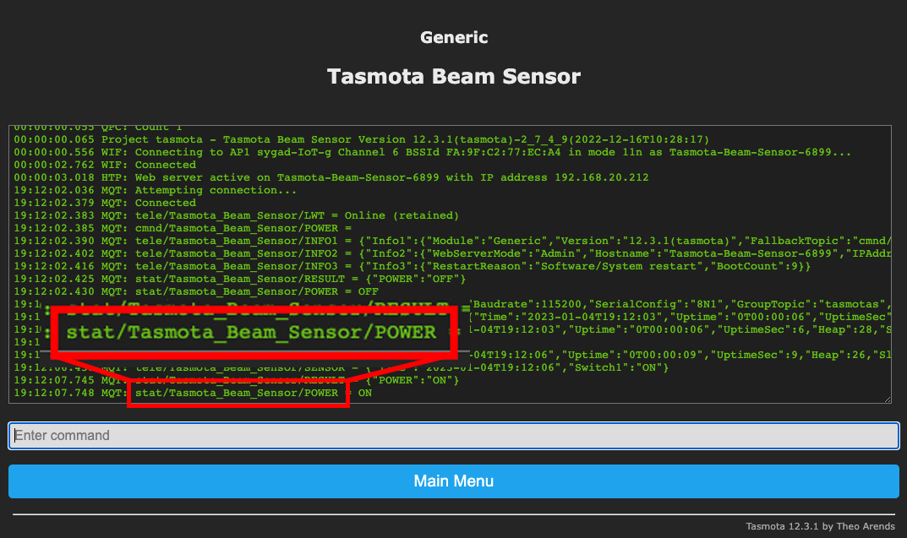

# IR Beam Sensor using ESPHome

### Scenario
Delivery driver walks down the driveway, I need **fast** and reliable indication of the event, e.g. Light flash, _(I wear headphones all day)_

<br>

### Problem with existing methods
- [Philips Hue outdoor motion sensors](https://www.amazon.co.uk/Philips-Hue-Outdoor-Lighting-Accessory/dp/B09CV7MT5S/ref=sr_1_3?keywords=philips+hue+motion+sensor&qid=1672824648&sr=8-3) can be slow and are not 100% reliable for capturing motion events _(personal experience)_
- CCTV motion events are even slower.
- Dedicating an old tablet to permanently monitor the CCTV for the driveway is a limited solution.
- Doorbell camera waits for button press to alert me, _(delivery drivers don't always do this)_ **OR** they leave immediately after pressing the button.

<br>

### End goal
- Use ESPresence to flash the light of any room in the house it detects that I am present in.
- IR beam trigger event uses tasker to launch my doorbell cam app, giving me a 5-10s head start and not relying on the door bell button press event.


<br>


## ESPHome Code

Create a new ESPHome project, adding the code below.

```
esphome:
  name: stairs-beam-sensor 

esp8266:
  board: d1_mini

# Enable logging
logger:

# Enable Home Assistant API
api:

ota:

wifi:
  ssid: !secret wifi_ssid
  password: !secret wifi_password

  # Enable fallback hotspot (captive portal) in case wifi connection fails
  ap:
    ssid: "Stairs Beam Sensor Fallback Hotspot"
    password: "i7T22TUhHHYq"

captive_portal:

binary_sensor:
  - platform: gpio
    pin:
      number: D1
      inverted: true
      mode:
        input: true
        pullup: true
    filters:
      - delayed_on: 300ms
    name: "Stairs Beam Sensor"
    device_class: motion
```


<br>

## Bench test the code

Check that the new ESPHome device has been created and added to the devices list


Click on the Stairs Beam Sensor device to see a list of entities. You can test the Motion entity by connecting GND to D1, the motion entity will change from "Clear" to "Detected"


Connecting D1 to GND to simulate the IR beam sensor detecting motion


Finally, you can add the new Stairs Beam Sensor entity to a HA dashboard


<br>

## Parts
- [Indoor beam sensor](https://www.amazon.co.uk/gp/product/B07BTZDNBC/ref=ppx_yo_dt_b_search_asin_image?ie=UTF8&psc=1) | [Outdoor beam sensor](https://www.amazon.co.uk/gp/product/B01M14S944/ref=ppx_yo_dt_b_search_asin_image?ie=UTF8&psc=1) _(either sensor will work)_
- [Wemos D1 Mini](https://www.amazon.co.uk/AZDelivery-Development-ESP8266EX-Compatible-Micropython/dp/B08BTYHJM1/ref=sr_1_3?crid=36564IOYQDDOV&keywords=wemos%2Bd1%2Bmini&qid=1672824715&sprefix=wemos%2Bd1%2Bmini%2Caps%2C70&sr=8-3&th=1)
- [R-78E5.0-0.5](https://uk.rs-online.com/web/p/switching-regulators/7577239) switching regulator
- [DC power jack - DC005](https://www.amazon.co.uk/gp/product/B07F68RZY9/ref=ppx_yo_dt_b_search_asin_title?ie=UTF8&psc=1) _(optional)_
- [XH-2A connectors](https://www.amazon.co.uk/555pcs-Connector-XH-Adapter-Housing/dp/B0B45ST47P/ref=sr_1_2?crid=1R5XFBH0WHR3V&keywords=xh-2a+connectors&qid=1672824756&sprefix=xh-2a+connectors%2Caps%2C67&sr=8-2) _(optional)_
- [Dupont crimpers](https://www.amazon.co.uk/Ratchet-Yangoutool-Ratcheting-AWG28-20-Terminal/dp/B0895LN7QS/ref=sr_1_10?crid=12LFODXXF07U6&keywords=dupont+crimpers&qid=1672824794&sprefix=dupont+crimpers%2Caps%2C71&sr=8-10) _(optional)_

<br>

## Indoor IR beam sensor connections


IR beam relay is connected in the Normally Open (NO) position


## Custom PCB

[EasyEDA PCB file](https://github.com/sygad/IR-Beam-Sensor/blob/main/Circuit/EasyEDA%20files/PCB_PCB_IR%20BEam%20Sensor_2_2023-01-03.json) | 
[EasyEDA Schematic file](https://github.com/sygad/IR-Beam-Sensor/blob/main/Circuit/EasyEDA%20files/SCH_IR%20BEam%20Sensor_2023-01-03.json) | 
[Gerber files for PCB](https://github.com/sygad/IR-Beam-Sensor/blob/main/Circuit/EasyEDA%20files/Gerber_PCB_IR%20BEam%20Sensor_2_2023-01-04.zip)


<br>
<br>
<br>

# Project History

<br>

## V1
I followed [this excellent tutorial](https://www.inspectmygadgets.com/ir-beam-break-sensors-with-tasmota-and-home-assistant/), to [flash the Wemos D1 Mini with Tasmota](https://tasmota.github.io/docs/Getting-Started/#flashing) to send an ON / OFF trigger via MQTT to Home Assistant (HA).  I got this working but hit a few hurdles owing to my still learning HA.

<br>

**Questions I had after reading the tutorial:**
1. How do I configure the MQTT part of Tasmota on the Wemos?
2. How do I congifure HA **exactly** to recognise the Wemos and show the motion output?

<br>

**1. Configuring the Wemos with Tasmota**
- Ensure your MQTT server is setup in HA
- Obtain the IP address of the newly flashed Tasmota Wemos device from your router
- Go to the IP address of the new Tasmota device to configure MQTT

  _Configure MQTT on Tasmota_
  - Main Menu > Configuration > Configure MQTT
  - Enter the IP address of your MQTT server, (Home Assistant, IP address if using the Mosquitto add-on)
  - Enter the MQTT username and password


  _Configure MQTT Topic Name_
  - Main Menu > Configuration > Configure Other
  - Under Device Name, enter a name that will be used to pass MQTT messages

    

  _Confirm MQTT is sending messages using the chosen topic name_
  - Main menu > Console

    

<br>

**2. Configuring HA**

To get Home Assistant to recognise the incoming MQTT messages, I added the following code inside the **mqtt.yaml** _(Here for reference only, I no longer use this code, see V3 below.)_

```
binary_sensor:
  # Name used for entity
  - name: "Beam sensor motion"
    state_topic: "stat/Tasmota_Beam_Sensor/POWER"
    payload_on: "ON"
    payload_off: "OFF"
    qos: 0
    device_class: motion
    # icon: "mdi:leak"
```
<br>

Adding the Sensor to an Entities Card


<br>
<hr>
<br>


## V2
Transferring from prototype board to a custom PCB, I used this [voltage regulator](https://www.amazon.co.uk/gp/product/B07PPKR4HW/ref=ppx_yo_dt_b_search_asin_title?ie=UTF8&psc=1).

**I should have paid more attention** it was the wrong one: 
> 5.5V DC Voltage Regulator Step Down Power Supply Module 4.75V-12V to 5V 800mA

After destroying (3) ESP8266's, I decided to experiment with ESPHome and revise the entire circuit, looking for a better regulator to power the Wemos.

<figure>

<figcaption>1st custom PCB showing incorrect regulator header</figcaption>
</figure>


<br>
<hr>
<br>


## V3 (final)
I experimented with: _(aka, trying anything and everything to get it working)_:
- Powering the esp and the beam sensor seperately, which worked well.
- Pulling the resistor high in ESPHome
- Setting inverted to true

After a lot of _"experimentation"_, and confusing myself about sensors not closing, I [reached out to the Home Assistant community](https://community.home-assistant.io/t/esphome-ir-beam-sensor-code-help/507588)
and got some simple and excellent advice from [Aruffell](https://community.home-assistant.io/u/aruffell/summary) and [Julian Hall](https://community.home-assistant.io/u/juliandh/summary)

I made the following checks and alterations
- Beam sensor relay was a DRY relay (no connection on either relay terminal to the supply +ve / -ve)
- Made sure the relay was set to normally open (NO) _I actually hadn't checked this previously_
- PCB optimisations for solder pad size, spacing and track width
- Changed the V1 voltage regulator to a [L7805CV](https://www.amazon.co.uk/gp/product/B007DQ4FXC/ref=ppx_yo_dt_b_search_asin_title?ie=UTF8&psc=1). It ran too hot so I eventually settled on a Switching regulator [R-78E5.0-0.5](https://uk.rs-online.com/web/p/switching-regulators/7577239)

